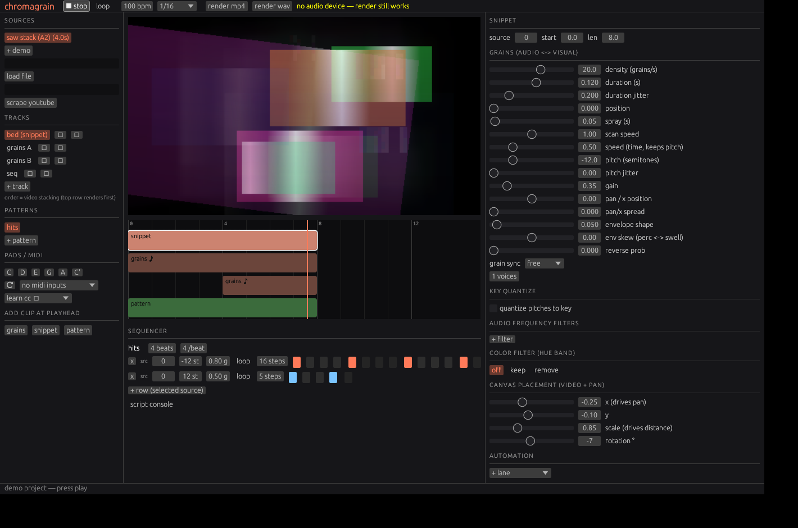
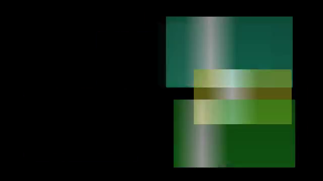

# chromagrain

A native audiovisual sampling & effects compositor / sequencer where **audio
and visual effects correspond** — built in Rust with rhai scripting.



The core idea: **granular synthesis is a first-class citizen, and every audio
grain IS a visual grain.** One scheduler emits grain events; the audio
renderer and the video compositor both consume the *same* events:

| grain field   | what you hear            | what you see                     |
|---------------|--------------------------|----------------------------------|
| onset / dur   | when the grain sounds    | when the patch appears           |
| envelope      | amplitude window         | opacity window                   |
| pitch ratio   | resampling / transposition | patch playback rate + hue rotation |
| pan           | stereo position          | horizontal position on canvas    |
| source pos    | waveform read position   | video read position              |
| reverse       | backwards audio          | backwards video                  |

So a cloud of high, short, wide-panned grains *sounds* sparkly and *looks*
like small, hue-shifted, scattered patches — automatically. **The
correspondence itself is configurable**: every mapping is a dial on the
clip's AV link (0 = unlinked, 1 = fully linked, full correspondence is the
default), so you can, say, keep pitch→hue but let opacity ignore gain.

Clips come in two kinds: **grain clips** (clouds) and **snippets** — media
placed straight on the timeline. A snippet is rendered as ONE long grain, so
the same correspondence applies: its gain is its loudness *and* its opacity.



## AV effects — the crunch you hear is the crunch you see

Effect chains run per clip and on the master bus, and every effect processes
BOTH domains with the same idea:

| effect   | audio                            | video                              |
|----------|----------------------------------|------------------------------------|
| crush    | sample-rate decimation + bit depth reduction | pixelation + color posterize |
| delay    | feedback delay line              | ghost frames at the same delay/feedback, with optional drift |
| reverb   | Freeverb-style combs/allpasses   | frame persistence + blur smear     |
| compress | FFT spectral quantization (codec crunch) | JPEG-style 8×8 DCT block quantization — the same transform-domain math |

Each effect has independent `audio` and `video` amount dials — that's the
per-effect correspondence control (video 0 = audio-only effect, and vice
versa). It will be crunchy.

## Sequencing & performance

- **Step sequencer** (Koala / Nanoloop energy): patterns of rows, each row
  a sampler pad (source + hit preset + key), each step a beat-quantized
  trigger with optional per-step pitch/gain. Patterns sit ON the timeline
  as pattern clips and loop to fill them — the tool stays timeline-first,
  with the sequencer panel editing whatever pattern clip is selected.
  Every row has its **own step count** (a 5-step row against a 16-step
  grid phases against it — polymeter, drawn in blue), and rows can flip
  into **loop mode**: not sequenced at all, just repeating a start..stop
  slice of their source.
- **Automation**: drag across a strip to draw a curve on any grain
  parameter of a clip (density, pitch, position, gain, pan, spray, scan
  speed…), evaluated per grain so clouds morph as they play. Tracks get a
  drawable level curve that fades audio gain and video opacity together
  (through the same unlinkable correspondence dial).
- **Performance playback**: play is live — a streaming engine renders the
  project in blocks (verified sample-identical to the offline render) into
  the audio device while a **GPU shader pipeline** (grain quads, effect
  passes, track compositing) draws the video in real time. Loop a region,
  tweak grains/effects/steps mid-playback, hear and see it immediately.
- **Track mixer**: every track has its own AV effect chain ("this whole
  track has a lot of delay"), a level fader that ducks audio gain AND
  video opacity (unlinkable, like everything else), mute, and reorder —
  track order is the video compositing z-order.
- **Render button**: the deterministic CPU renderer bounces the
  arrangement to mp4/wav for output; the GPU path is for performing.

## Features

- **Granular engine** (sampler first, and the deepest part of the tool) —
  density, duration ± jitter, spray, scan speed, pitch ± jitter, per-grain
  reverse, deterministic seeds (same seed = same cloud). Grains resample
  with 4-point Hermite interpolation; the grain window has a **skew**
  morphing percussive → symmetric → swell (and the visual grain's opacity
  follows the same shape); onsets can **beat-sync** to a 1/32–1/4 grid for
  rhythmic clouds; and each grain can stack up to 4 **harmony voices** at
  a chosen interval (octaves, fifths…), key-quantized, detuned and spread.
- **Speed and pitch are separate** — a snippet's `speed` changes tempo
  without touching pitch (granular time-stretch under the hood; video
  crossfades along at the same rate), while `pitch` transposes without
  changing tempo. Set them to match and it collapses to a pristine
  record-player resample automatically.
- **Canvas placement** — every clip's video can be positioned, scaled and
  rotated on the canvas. Placement is audible: x position drives pan and
  scale drives loudness (the distance cue of a simple 3D panning model),
  each through its own unlinkable correspondence dial.
- **MIDI** — play any clip like a pad instrument (sampler mapping, C4 =
  unity, velocity → gain, live in audio AND video, transport running or
  not), and map hardware CCs to any automatable parameter or track level
  with MIDI-learn. On-screen pads work without hardware.
- **Key quantization** — every grain's pitch is snapped so
  `base_pitch × ratio` lands on a chosen key/scale (major, minor, harmonic
  minor, pentatonics, blues, modes, whole-tone…). Source base pitch is
  auto-detected via autocorrelation on import.
- **Frequency filtering** — per-clip biquad chains (low/high/band-pass,
  notch) filter out audio frequency bands before granulation.
- **Color filtering** — the visual analog: keep or remove a hue band
  (HSV keying with soft edges) from the visual grains.
- **Timeline sequencer** — BPM-based multitrack timeline; clips hold a
  source + grain settings + key + filters; drag clips, click to seek.
- **YouTube scraping** — `yt-dlp`-powered import (capped at 480p / 90s),
  decoded through ffmpeg into grain-ready audio + frames.
- **Scripting** — the whole engine is drivable from [rhai](https://rhai.rs)
  scripts, in the in-app console or headless from the CLI.
- **Bounce & play** — cpal audio playback with synced video preview, and
  mp4/wav export through ffmpeg.

## How to run it

### 1. Install what it needs

| what | why | how |
|------|-----|-----|
| Rust (stable) | build | https://rustup.rs |
| ALSA headers (Linux only) | audio device + MIDI | `sudo apt install libasound2-dev pkg-config` |
| ffmpeg + ffprobe | load mp4/mov/webm…, export mp4 | `sudo apt install ffmpeg` / `brew install ffmpeg` |
| yt-dlp (optional) | YouTube scraping | `pip install yt-dlp` |

Without ffmpeg you can still load .wav files, use procedural sources, and
render .wav; without yt-dlp everything except `youtube(...)` works.
macOS and Windows need no extra system libraries.

### 2. Build & launch

```sh
git clone <this repo> && cd <repo>
cargo run --release            # builds (first time takes a few minutes) and opens the app
```

The binary lands at `target/release/chromagrain` if you want to launch it
directly later. `cargo test` runs the full engine test suite.

### 3. First session, in 60 seconds

1. The app opens with a demo project. Press **▶ play** — playback is live
   (GPU-rendered video, streaming audio); tweak any slider while it runs.
2. **Load your media**: type a file path into the left panel and hit
   *load file* (any format ffmpeg reads), or paste a YouTube URL and hit
   *scrape youtube*. The source's base pitch is auto-detected.
3. **Put something on the timeline**: pick a source, pick a track, then
   *grains* (granular cloud), *snippet* (plays straight), or *pattern*
   (step sequencer). Clips land at the playhead; drag them around
   (snapping follows the quantize picker in the top bar).
4. **Shape it** in the right panel: grain params, key quantize, filters,
   the AV effect chain, correspondence dials, and drag-to-draw automation.
5. **Sequence** in the panel under the timeline: click steps on/off, give
   a row its own step count for polymeter, or flip a row to *loop* mode.
6. **Play it like a sampler**: click the pads in *pads / midi* — or plug
   in a MIDI keyboard, pick its port in the dropdown, and play. Notes are
   sampler-mapped (C4 = the selected clip's pitch); this works even with
   the transport stopped. Map hardware knobs with *learn cc →* (pick a
   parameter, then twist a knob).
7. **Render** with the *render mp4* / *render wav* buttons — the output
   lands in the working directory as `chromagrain-render.mp4/.wav`,
   rendered by the deterministic offline engine.

### Headless / scripted

```sh
chromagrain --script examples/sequencer.rhai   # build + render a composition from a script
chromagrain --script examples/crunchy.rhai
chromagrain --render-demo out.mp4              # render the built-in demo project
```

## Scripting

```rhai
let s = session(100.0);                  // bpm
let src = s.youtube("https://www.youtube.com/watch?v=…");
// or: s.load("clip.mp4"), s.load("sample.wav"), s.demo_source()

let t = s.track("grains");
let c = s.clip(t, src, 0.0, 16.0);       // track, source, start beat, length beats
s.key(c, "C", "dorian");                 // quantize grain pitches to a key
s.set(c, "density", 28.0);               // grains per second
s.set(c, "duration", 0.12);
s.set(c, "pitch_jitter", 9.0);           // semitones (then quantized)
s.set(c, "spray", 1.2);                  // read-position randomness (s)
s.set(c, "scan_speed", 0.7);             // read-head speed vs realtime
s.audio_filter(c, "bandpass", 1000.0, 1.2);  // filter audio frequencies
s.color_remove(c, 120.0, 80.0);              // filter out a hue band

let b = s.snippet(t, src, 16.0, 8.0);    // media straight on the timeline
s.set(b, "gain", 0.5);                   // loudness AND opacity
s.set(b, "gain_to_opacity", 0.0);        // ...unless you unlink it

let fx = s.effect(c, "crush");           // AV effect chains
s.fx(c, fx, "bits", 4.0);                // heard as bitcrush, seen as posterize
s.fx(c, fx, "video", 0.5);               // per-effect correspondence dial
let m = s.master_effect("compress");     // master bus crunch
s.master_fx(m, "quality", 0.3);

let d = s.track_effect(t, "delay");      // track-level chains
s.track_fx(t, d, "feedback", 0.6);
s.track_level(t, 0.8);                   // audio gain AND video opacity

let p = s.pattern("hits");               // step sequencer
s.pattern_grid(p, 4.0, 4);               // 4 beats, 16th steps
let r = s.row(p, src);
s.row_key(p, r, "A", "minor_pentatonic");
s.row_steps(p, r, 5);                    // own step count -> polymeter
s.step(p, r, 0, true);
s.step_pitch(p, r, 3, 12.0);
let l = s.row(p, src);
s.row_loop(p, l, 0.25, 0.5);             // loop mode: repeat a source slice
s.pattern_clip(t, p, 0.0, 16.0);         // loops on the timeline

s.set(b, "speed", 0.5);                  // half-time, same pitch
s.transform(b, -0.3, 0.0, 0.7, -8.0);    // place/scale/rotate; x pans audio

s.automate(c, "density", 0.0, 5.0);      // parameter automation over time
s.automate(c, "density", 16.0, 60.0);    // (per-grain: the cloud thickens)
s.track_level_point(t, 0.0, 0.0);        // track fade: gain AND opacity
s.track_level_point(t, 8.0, 1.0);

s.render(0.0, 16.0, "out.mp4");          // .mp4 / .wav / .png
```

Settable clip parameters: `density, duration, duration_jitter, position,
spray, scan_speed, pitch, pitch_jitter, gain, pan, pan_spread, envelope,
env_skew, reverse_prob, sync_div, voices, voice_interval, voice_detune,
seed` (grains), `size_scale, min_size, max_size, additive, scatter_y`
(visual style), and the correspondence dials `gain_to_opacity,
envelope_to_opacity, pitch_to_hue, pitch_to_rate, pan_to_x, reverse_video`.
Effects: `effect(clip, kind)` / `master_effect(kind)` with kinds
`crush | delay | reverb | compress`, parameters via `fx` / `master_fx`
(`downsample, bits`; `time, feedback, mix, shift_x, shift_y`;
`size, damp, mix`; `quality`; plus `audio` and `video` on every effect).
Other calls: `bpm`, `canvas`, `sine_source`, `source_secs`, `base_hz`,
`set_base_hz`, `no_key`, `clear_audio_filters`, `clear_effects`,
`clear_master_effects`, `color_keep`, `no_color_filter`,
`ffmpeg_available`, `ytdlp_available`.

## Architecture

```
crates/core        chromagrain-core (headless, fully tested)
  music.rs         notes, scales, keys, quantize_ratio
  dsp.rs           RBJ biquads, tukey grain envelope, pitch detection, PRNG
  grain.rs         GrainSettings -> [GrainEvent]  (the shared AV events)
  audio.rs         AudioClip, granular audio renderer, stereo bus + soft clip
  video.rs         Frame/VideoClip, HSV, ColorFilter, AvLink, grain compositor
  fx.rs            AV effects: crush/delay/reverb/compress, streaming audio
                   states (block == offline, exactly), FFT + 8x8 DCT
  seq.rs           step sequencer: StepPattern/SeqRow/Step -> grain events
  timeline.rs      Source / Clip (granular|snippet|pattern) / Track / Project
  render.rs        offline renderer: clip -> track -> master, z-ordered
  realtime.rs      streaming performance engine (loop region, live edits)
  media.rs         wav/png IO, ffmpeg decode/encode, yt-dlp fetch
  script.rs        rhai bindings over all of the above
crates/app         chromagrain (desktop app)
  main.rs          eframe GUI: preview, timeline, sequencer, inspector
  gpu.rs           glow/OpenGL realtime pipeline: grain quads + effect
                   shader passes + track compositing + live pad layer
  playback.rs      always-on engine: lock-free ring into cpal, transport
                   start/stop, live pad triggers any time
  midi.rs          midir input, note pads, CC mappings with learn
```

The renderer is deterministic: a project + seeds always produces the same
grains, samples, and pixels — renders are reproducible and testable.
