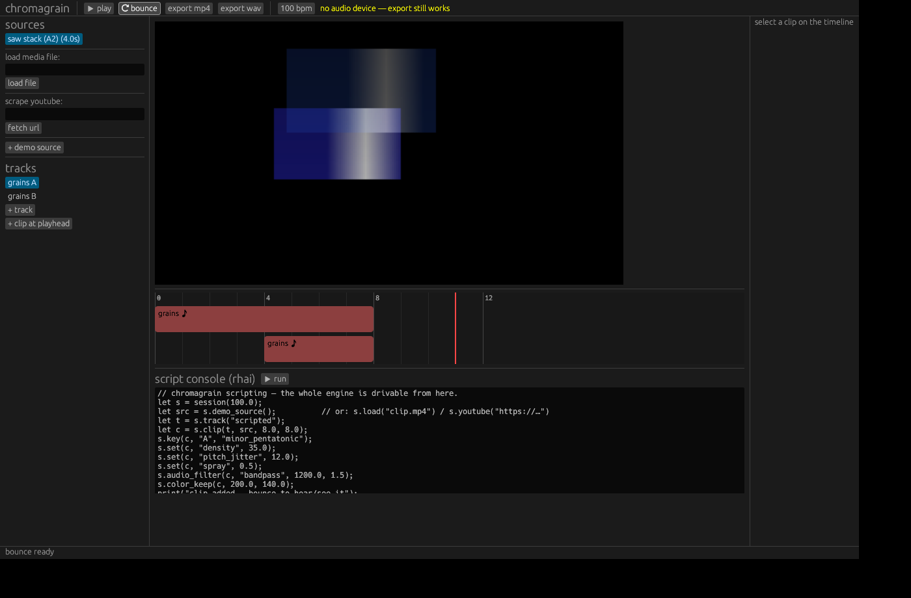

# chromagrain

A native audiovisual sampling & effects compositor / sequencer where **audio
and visual effects correspond** — built in Rust with rhai scripting.



The core idea: **granular synthesis is a first-class citizen, and every audio
grain IS a visual grain.** One scheduler emits grain events; the audio
renderer and the video compositor both consume the *same* events:

| grain field   | what you hear            | what you see                     |
|---------------|--------------------------|----------------------------------|
| onset / dur   | when the grain sounds    | when the patch appears           |
| envelope      | amplitude window         | opacity window                   |
| pitch ratio   | resampling / transposition | patch playback rate + hue rotation |
| pan           | stereo position          | horizontal position on canvas    |
| source pos    | waveform read position   | video read position              |
| reverse       | backwards audio          | backwards video                  |

So a cloud of high, short, wide-panned grains *sounds* sparkly and *looks*
like small, hue-shifted, scattered patches — automatically.


## Features

- **Granular engine** — density, duration, spray, scan speed, pitch ±
  jitter, per-grain reverse, deterministic seeds (same seed = same cloud).
- **Key quantization** — every grain's pitch is snapped so
  `base_pitch × ratio` lands on a chosen key/scale (major, minor, harmonic
  minor, pentatonics, blues, modes, whole-tone…). Source base pitch is
  auto-detected via autocorrelation on import.
- **Frequency filtering** — per-clip biquad chains (low/high/band-pass,
  notch) filter out audio frequency bands before granulation.
- **Color filtering** — the visual analog: keep or remove a hue band
  (HSV keying with soft edges) from the visual grains.
- **Timeline sequencer** — BPM-based multitrack timeline; clips hold a
  source + grain settings + key + filters; drag clips, click to seek.
- **YouTube scraping** — `yt-dlp`-powered import (capped at 480p / 90s),
  decoded through ffmpeg into grain-ready audio + frames.
- **Scripting** — the whole engine is drivable from [rhai](https://rhai.rs)
  scripts, in the in-app console or headless from the CLI.
- **Bounce & play** — cpal audio playback with synced video preview, and
  mp4/wav export through ffmpeg.

## Building

```sh
cd chromagrain
cargo build --release          # binary: target/release/chromagrain
cargo test                     # 38 unit + integration tests
```

Linux needs ALSA headers to build (`apt install libasound2-dev`). Runtime
media features shell out to external tools on PATH:

- `ffmpeg`/`ffprobe` — decoding any media file, mp4 export (`apt install ffmpeg`)
- `yt-dlp` — YouTube scraping (`pip install yt-dlp`)

Everything else (wav import, procedural sources, rendering, playback) works
without them.

## Running

```sh
chromagrain                                # GUI, loads a demo project
chromagrain --script examples/demo.rhai    # headless scripted render
chromagrain --render-demo out.mp4          # render the demo project
```

## Scripting

```rhai
let s = session(100.0);                  // bpm
let src = s.youtube("https://www.youtube.com/watch?v=…");
// or: s.load("clip.mp4"), s.load("sample.wav"), s.demo_source()

let t = s.track("grains");
let c = s.clip(t, src, 0.0, 16.0);       // track, source, start beat, length beats
s.key(c, "C", "dorian");                 // quantize grain pitches to a key
s.set(c, "density", 28.0);               // grains per second
s.set(c, "duration", 0.12);
s.set(c, "pitch_jitter", 9.0);           // semitones (then quantized)
s.set(c, "spray", 1.2);                  // read-position randomness (s)
s.set(c, "scan_speed", 0.7);             // read-head speed vs realtime
s.audio_filter(c, "bandpass", 1000.0, 1.2);  // filter audio frequencies
s.color_remove(c, 120.0, 80.0);              // filter out a hue band
s.render(0.0, 16.0, "out.mp4");          // .mp4 / .wav / .png
```

Settable parameters: `density, duration, duration_jitter, position, spray,
scan_speed, pitch, pitch_jitter, gain, pan_spread, envelope, reverse_prob,
seed` (grains) and `size_scale, min_size, max_size, hue_per_semitone,
additive, scatter_y` (visual style). Other calls: `bpm`, `canvas`,
`sine_source`, `source_secs`, `base_hz`, `set_base_hz`, `no_key`,
`clear_audio_filters`, `color_keep`, `no_color_filter`,
`ffmpeg_available`, `ytdlp_available`.

## Architecture

```
crates/core        chromagrain-core (headless, fully tested)
  music.rs         notes, scales, keys, quantize_ratio
  dsp.rs           RBJ biquads, tukey grain envelope, pitch detection, PRNG
  grain.rs         GrainSettings -> [GrainEvent]  (the shared AV events)
  audio.rs         AudioClip, granular audio renderer, stereo bus + soft clip
  video.rs         Frame/VideoClip, HSV, ColorFilter, visual grain compositor
  timeline.rs      Source / Clip / Track / Project (beats <-> seconds)
  render.rs        offline renderer: timeline -> audio buffer + frames
  media.rs         wav/png IO, ffmpeg decode/encode, yt-dlp fetch
  script.rs        rhai bindings over all of the above
crates/app         chromagrain (desktop app)
  main.rs          eframe GUI: timeline, preview, inspector, script console
  playback.rs      cpal playback of bounced audio
```

The renderer is deterministic: a project + seeds always produces the same
grains, samples, and pixels — renders are reproducible and testable.
